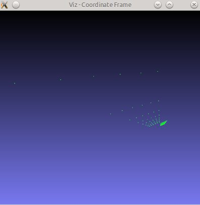
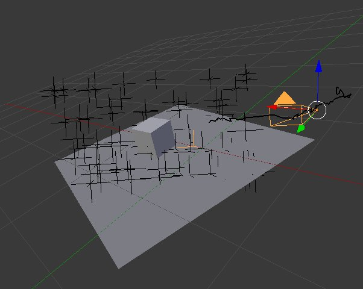

Structure From Motion module
============================

This module contains algorithms to perform 3d reconstruction from 2d images. The core of the module is a light version of [libmv](http://code.google.com/p/libmv/) which is a Structure from Motion (SfM) library divided into different modules (image/detector/descriptor/multiview) that allow to resolve part of the SfM process.

The main reconstruction API currently uses the open-source [Ceres Solver](http://ceres-solver.org/) in order to solve part of the Bundle Adjustment plus the points Intersect. If Ceres Solver is not installed on your system, the reconstruction funcionality will be disabled.

Ceres installation (Linux)
--------------------------

Here are the instructions on how to install the Ceres Solver on your machine (Linux).

    sudo apt-get install libceres-dev

Run
---

There are some samples provided in order to show the reconstruction functionality use.

**recon2v.cpp**

This program shows the two view reconstruction capabilities in the OpenCV Structure From Motion (SFM) module. It uses the following data from the VGG datasets at "reconv2 _pts.txt" where the first line has the number of points and each subsequent line has entries for matched points as: x1 y1 x2 y2. Finally, the script reconstructs the given set of correspondences and show the result using the OpenCV 3d visualizer (viz).

  

**nView_scene_reconstruction.cpp**

This program shows the n view reconstruction capabilities in the OpenCV Structure From Motion (SFM) module. It loads a file with the tracked 2d points over all the frames. The file must have the following structure:

row1 : x1 y1 x2 y2 ... x36 y36 for track 1

row2 : x1 y1 x2 y2 ... x36 y36 for track 2

i.e. a row gives the 2D measured position of a point as it is tracked through frames 1 to 36. If there is no match found in a view then x and y are -1. Each row corresponds to a different point.

The loaded data is embedded into a vector of 2d points array, where each inner array represents a different frame. Every frame is composed by a list of 2d points which e.g. the first point in frame 1 is the same point in frame 2. If there is no point in a frame the value will be (-1,-1).

To run this example you can type the following line command in the opencv binaries directory specifying the file path in your system and the camera intrinsics (in this case obtained from the scene generation script).

    ./example_sfm_nView_scene_reconstruction /path_to_opencv_contrib/samples/data/backyard_tracks.txt 800 400 225

Finally, the script reconstructs the given set of tracked points and show the result using the OpenCV 3d visualizer (viz). On the left image the original scene from where we extracted the input file, on the right, the obtained result.

  
  

**random_scene_reconstruction.cpp**

//TODO

**random_scene_reconstruction.cpp**

//TODO

